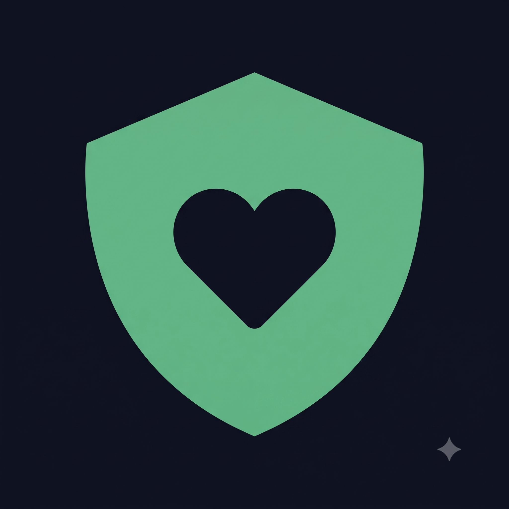

# 🏥 CareProtocol AI

<p align="center">
  
</p>

<p align="center">
  <strong>Zero-Hardware Edge AI Post-Operative Telerehabilitation & Decentralized Clinical Verification</strong><br>
  <em>Nền Tảng Phục Hồi Chức Năng Hậu Phẫu Thông Minh & Xác Thực Bệnh Án Bất Biến Trên Solana Blockchain</em>
</p>

<p align="center">
  <a href="#-tổng-quan-dự-án-executive-summary"></a>
  <a href="#-tích-hợp-solana-blockchain--hệ-sinh-thái-desci"></a>
  <a href="#-core-engineering--clinical-edge-ai"></a>
  <a href="#-kiến-trúc-hệ-thống--bảo-mật-hipaa-system-architecture"></a>
  <a href="#-bản-quyền--giấy-phép-license"></a>
</p>

---

## 📌 Mục Lục (Table of Contents)

1. [🌟 Tổng Quan Dự Án (Executive Summary)](#-tổng-quan-dự-án-executive-summary)
2. [🧠 Core Engineering & Clinical Edge AI](#-core-engineering--clinical-edge-ai)
3. [🏛️ Kiến Trúc Hệ Thống & Bảo Mật HIPAA (System Architecture)](#-kiến-trúc-hệ-thống--bảo-mật-hipaa-system-architecture)
4. [⚡ Tích Hợp Solana Blockchain & Hệ Sinh Thái DeSci](#-tích-hợp-solana-blockchain--hệ-sinh-thái-desci)
5. [📹 Hệ Thống Giám Sát Buồng Bệnh Thông Minh (Smart Tele-ICU)](#-hệ-thống-giám-sát-buồng-bệnh-thông-minh-smart-tele-icu)
6. [📊 Ma Trận Tính Năng (Feature Comparison Matrix)](#-ma-trận-tính-năng-feature-comparison-matrix)
7. [🛠️ Công Nghệ Sử Dụng (Tech Stack)](#-công-nghệ-sử-dụng-tech-stack)
8. [🚀 Hướng Dẫn Trải Nghiệm & Cài Đặt (Quickstart Guide)](#-hướng-dẫn-trải-nghiệm--cài-đặt-quickstart-guide)
9. [👥 Đội Ngũ Phát Triển (Core Team & Co-Founders)](#-đội-ngũ-phát-triển-core-team--co-founders)
10. [🗺️ Lộ Trình Phát Triển (Roadmap)](#-lộ-trình-phát-triển-roadmap)
11. [📜 Bản Quyền & Giấy Phép (License)](#-bản-quyền--giấy-phép-license)

---

## 🌟 Tổng Quan Dự Án (Executive Summary)

### 1. Thách thức lâm sàng thực tế (The Clinical Crisis)
Trong quy trình chăm sóc và phục hồi chức năng sau các ca đại phẫu (tái tạo dây chằng chéo trước **ACL**, thay khớp gối nhân tạo **TKA**, phẫu thuật cột sống, mổ lấy thai **C-Section**...):
* **Hơn 75% bệnh nhân** không duy trì tập luyện đúng phác đồ khi xuất viện về nhà do thiếu vắng sự giám sát trực tiếp của chuyên viên vật lý trị liệu.
* **Tập sai tư thế & quá sức** tiềm ẩn rủi ro nghiêm trọng: đứt lại mảnh ghép dây chằng mới tái tạo, lỏng khớp nhân tạo, viêm dính bao khớp hoặc teo cơ tiến triển.
* **Tai biến té ngã tại nhà & buồng bệnh**: Theo số liệu y tế lâm sàng, hơn **70% các ca té ngã nặng** xảy ra khi người bệnh tự ý rời giường một mình vào ban đêm mà không có sự trợ giúp.
* **Rào cản thiết bị đeo (Wearable Burden)**: Các cảm biến đo gia tốc/con quay hồi chuyển hiện nay có giá thành đắt đỏ ($300 – $1,500), vướng víu khi mang trên vết mổ và gây khó khăn lớn đối với người cao tuổi.

### 2. Giải pháp CareProtocol AI
**CareProtocol** mang đến giải pháp y tế số **Zero-Hardware** (không cần bất kỳ cảm biến đeo nào), tận dụng camera có sẵn trên laptop hoặc điện thoại thông minh để đồng hành cùng người bệnh:
* **100% Client-Side Edge AI**: Phân tích thời gian thực 33 điểm mốc giải phẫu (Anatomical Landmarks), đo góc chuyển động (ROM) chính xác từng độ, đếm lượt tập chuẩn y khoa và phản hồi bằng giọng nói tiếng Việt tự nhiên.
* **Mô hình động học té ngã 2 pha (Fall Kinematics)**: Triệt tiêu báo động giả khi người bệnh nằm/ngồi kiểm soát, tích hợp khả năng nhận diện khẩu lệnh cấp cứu khẩn cấp (**Voice SOS**).
* **Smart Hospital Tele-ICU Ward**: Định danh khuôn mặt bệnh nhân (Face ID), thiết lập vùng an toàn quanh giường (**Bed-Zone Spatial ROI**), phân tách dữ liệu khách thăm và phát cảnh báo sớm khi người bệnh rời giường (**Bed-Exit Early Warning**).
* **Bệnh án điện tử SOAP Gen-AI & Xác thực Solana On-Chain**: Tự động tổng hợp báo cáo lâm sàng chuẩn quốc tế (Subjective, Objective, Assessment, Plan) và neo giữ bằng chứng bất biến qua chữ ký mật mã trên Blockchain Solana.

---

## 🧠 Core Engineering & Clinical Edge AI

### 1. Phân Tích Động Học 33 Điểm Khớp (Zero-Hardware MediaPipe BlazePose)
Hệ thống tích hợp mô hình thị giác máy tính **Google MediaPipe BlazePose** chạy trực tiếp trên trình duyệt client thông qua công nghệ **WebAssembly (WASM)** và tăng tốc phần cứng GPU bằng **WebGL**:
* **Tần số xử lý (Inference Rate)**: Đạt tốc độ ổn định từ 30 – 60 FPS với độ trễ xử lý cực thấp ($< 25\text{ ms}$).
* **Đo góc biên độ vận động (ROM - Range of Motion)**: Tính toán góc Euler 3D giữa các bộ ba landmark giải phẫu (ví dụ Khớp gối: Hông $\to$ Gối $\to$ Cổ chân).
* **Chuẩn hóa phác đồ quốc tế**: Dữ liệu góc được đối chiếu theo hướng dẫn của **Hiệp hội Phẫu thuật Chỉnh hình Hoa Kỳ (AAOS)** và chương trình phục hồi sớm sau phẫu thuật **ERAS (Enhanced Recovery After Surgery)**.

### 2. Thuật Toán Động Học Té Ngã 2 Pha (Fall Kinematics Model)
Các giải pháp camera thông thường thường gặp lỗi báo động sai khi người bệnh nằm hoặc ngồi xuống giường từ từ. CareProtocol giải quyết dứt điểm vấn đề này bằng bộ lọc động học 2 pha:

$$\text{Pha 1 (Vận tốc rơi trọng tâm hông): } v_{\text{drop}} = \frac{\Delta y_{\text{hip}}}{\Delta t} > 0.65\text{ m/s} \quad (\text{với } \Delta t \in [0.016, 0.066]\text{s})$$

$$\text{Pha 2 (Tiếp đất bất động): } \theta_{\text{torso}} = \arctan\left(\frac{|\Delta y|}{|\Delta x|}\right) < 35^\circ \quad (\text{duy trì } \ge 3 \text{ frames})$$

* **Khoảng đệm an toàn 10 giây (10s Grace Period)**: Khi phát hiện dấu hiệu ngã hoặc tiếng hô cứu nạn, hệ thống bật đồng hồ đếm ngược 10 giây kèm nút `[🛡️ Tôi An Toàn / Hủy Báo Động]`. Nếu người bệnh vô tình vấp nhẹ hoặc chào hỏi bình thường, họ có thể hủy ngay mà không kích hoạt chuông báo động y tế.

### 3. Phát Hiện Run Cơ & Mỏi Thần Kinh Cơ (Tremor & Muscle Fatigue Detection)
* **Cơ sở y sinh học**: Khi các sợi cơ vận động cạn kiệt glycogen, xung kích hoạt thần kinh cơ bị ngắt quãng, tạo ra các vi dao động bất thường ở dải tần số từ $7.5 - 12\text{ Hz}$.
* **Thuật toán Cửa sổ trượt (Sliding Window 30 frames)**: Đo độ lệch chuẩn vi dao động ($\sigma_{\text{jitter}}$). Khi phát hiện dấu hiệu run cơ vượt ngưỡng an toàn lâm sàng, hệ thống kích hoạt cảnh báo HUD và đếm ngược nghỉ ngơi bắt buộc 45 giây nhằm chống nguy cơ rách mảnh ghép dây chằng mới mổ.

### 4. Khung Xương Bác Sĩ Ảo Thích Ứng (Ghost Doctor Adaptive Engine)
* **Thích ứng nhịp độ sinh lý theo lứa tuổi**: Tự động giảm tốc độ chuyển động (~7 giây/chu kỳ) và co hẹp góc nâng (65% - 70% ROM) đối với bệnh nhân cao tuổi ($\ge 65$ tuổi) hoặc mới mổ trong 4 ngày đầu.
* **Cân bằng hai bên tự động (Bilateral Auto-Balance)**: Tự động chia bài tập thành 2 nửa hiệp cân đối (5 lần chân Phải ⇄ 5 lần chân Trái), giọng đọc AI Voice Coach tự động phát âm thanh hướng dẫn người bệnh đổi bên nhịp nhàng.

---

## 🏛️ Kiến Trúc Hệ Thống & Bảo Mật HIPAA (System Architecture)

### Sơ Đồ Kiến Trúc Hai Tầng (Hybrid Edge / On-Chain Architecture)

```text
┌───────────────────────────────────────────────────────────────────────────────┐
│                        TẦNG CLIENT-SIDE (EDGE COMPUTING)                      │
│                                                                               │
│   [ Camera Web / Mobile Device ]                                              │
│              │                                                                │
│              ├───────────────────────────────────┐                            │
│              ▼                                   ▼                            │
│   [ MediaPipe BlazePose WASM ]       [ Edge Face ID & Bed-Zone ]              │
│   • Theo dõi 33 điểm khớp            • Định danh khuôn mặt EMR                │
│   • Đo ROM & bắt run cơ              • Giám sát rPPG nhịp tim                 │
│   • Động học té ngã 2 pha            • Cảnh báo rời giường (Bed-Exit)         │
│              │                                   │                            │
│              └─────────────────┬─────────────────┘                            │
│                                ▼                                              │
│                   [ Web Crypto API (SHA-256) ]                                │
│                   • Tạo chuỗi băm Session Merkle Root                         │
│                   • Bảo mật toàn vẹn dữ liệu lâm sàng                         │
│                                │                                              │
│                                ▼                                              │
│               [ Trợ Lý Bệnh Án SOAP (Gen-AI Engine) ]                         │
│               • Xuất tóm tắt y khoa chuẩn quốc tế (S-O-A-P)                   │
└────────────────────────────────┬──────────────────────────────────────────────┘
                                 │ Chữ ký mật mã Ed25519 (Phantom Wallet)
                                 ▼
┌───────────────────────────────────────────────────────────────────────────────┐
│                        TẦNG SOLANA BLOCKCHAIN NETWORK                         │
│                                                                               │
│   • SPL Memo Instruction / Anchor Smart Attestation                           │
│   • Chi phí giao dịch: ~0.000005 SOL • Finality < 1s                          │
│   • Schema chuẩn hóa: CareProtocol.v1 (Tương thích HL7 FHIR)                  │
│   • Sổ cái bất biến (Immutable Audit Trail) phục vụ Bác sĩ & Bảo hiểm         │
└───────────────────────────────────────────────────────────────────────────────┘
```

### Triết Lý Bảo Mật Y Tế Chuẩn HIPAA & GDPR
1. **Zero Raw-Video Storage**: Toàn bộ luồng video và hình ảnh được xử lý trực tiếp trong bộ nhớ tạm (RAM) của trình duyệt. Không có bất kỳ khung hình video hay dữ liệu sinh trắc học nhạy cảm nào bị gửi ra máy chủ bên ngoài.
2. **Cryptographic Proof-of-Rehab**: Thay vì lưu thông tin định danh cá nhân (PHI) lên blockchain công khai (vi phạm quyền riêng tư y tế), hệ thống đóng gói toàn bộ buổi tập thành một chuỗi băm Merkle Root:

$$\text{SessionHash} = \text{SHA256}(\text{PatientID} \parallel \text{Timestamp} \parallel \text{TargetROM} \parallel \text{AchievedROM} \parallel \text{ValidReps} \parallel \text{QualityScore})$$

Chuỗi băm này được ký số và neo giữ vĩnh viễn trên Solana, cho phép bất kỳ bác sĩ hay công ty bảo hiểm nào cũng có thể kiểm tra tính toàn vẹn của hồ sơ bệnh án mà không xâm phạm quyền riêng tư của bệnh nhân.

---

## ⚡ Tích Hợp Solana Blockchain & Hệ Sinh Thái DeSci

### 1. Vì Sao Solana Là Lựa Chọn Tối Ưu Cho Y Tế Số?
* **Tốc độ xác nhận tức thời (Finality < 1s)**: Bệnh nhân nhận được xác nhận hoàn thành bài tập ngay lập tức khi vừa kết thúc động tác.
* **Chi phí giao dịch tiệm cận 0 (~0.000005 SOL / giao dịch)**: Bệnh nhân có thể ghi nhận hàng chục buổi tập mỗi tuần mà không lo ngại về chi phí gas như trên Ethereum hay các L2 truyền thống.
* **Thông lượng khổng lồ (High Throughput)**: Sẵn sàng mở rộng quy mô phục vụ hàng triệu người bệnh cùng tập luyện đồng thời trên toàn quốc.

### 2. Cấu Trúc Dữ Liệu On-Chain Chuẩn Hóa (`CareProtocol.v1`)
Payload lưu trữ trên Solana được chuẩn hóa tương thích định dạng trao đổi y tế quốc tế **HL7 FHIR**:

```json
{
  "protocol": "CareProtocol.v1",
  "app": "careprotocol.health",
  "patientId": "BN-2026-402",
  "protocolKey": "tka_phase1",
  "metrics": {
    "targetRom": 90,
    "achievedRom": 92,
    "validReps": 10,
    "qualityScore": 95,
    "tremorDetected": false,
    "fallStatus": "safe"
  },
  "merkleRoot": "0x7f83b1657ff1fc53b92dc18148a1d65dfc2d4b1fa3d677284addd200126d9069",
  "timestamp": 1728135600
}
```

### 3. Tiềm Năng Mở Rộng Hệ Sinh Thái Khoa Học Phi Tập Trung (DeSci)
* **Bảo hiểm Y tế Tham số (Parametric Smart Insurance)**: Hợp đồng thông minh bảo hiểm có thể tự động đọc chỉ số tuân thủ phục hồi (`qualityScore`, `achievedRom`) trên Solana để tự động giải ngân chi trả quyền lợi bảo hiểm cho bệnh nhân.
* **Rehabilitation-to-Earn (R2E)**: Mở khóa cơ chế khen thưởng vi mô (micro-incentives) nhằm thúc đẩy tinh thần kiên trì tập luyện mỗi ngày.

---

## 📹 Hệ Thống Giám Sát Buồng Bệnh Thông Minh (Smart Tele-ICU)

Phân hệ Giám sát Buồng bệnh tại **Cổng Bác Sĩ** mở rộng năng lực của CareProtocol từ thiết bị cá nhân tại nhà thành một giải pháp quản lý buồng bệnh nội trú toàn diện:

1. **Khóa Mục Tiêu Khuôn Mặt (Face ID Target Lock)**:
   * Tự động nhận diện khuôn mặt thật trên luồng webcam với độ tin cậy $99.4\%$.
   * Đo nhịp tim quang học qua da mặt (**rPPG Heart Rate: 72 – 76 bpm**) theo thời gian thực.
2. **Vùng Giường Bệnh An Toàn (Bed-Zone Spatial ROI)**:
   * Thiết lập tọa độ không gian ảo bao quanh giường bệnh, định danh chính xác bệnh nhân đang nằm điều trị.
3. **Phân Tầng Vai Trò Đa Đối Tượng (Multi-Person Role Tagging)**:
   * Tách biệt rõ ràng **Bệnh nhân tại giường** (Khung xanh ngọc) và **Người nhà / Khách thăm** (Khung xám nét đứt).
   * Dữ liệu vận động của người nhà **tuyệt đối không bị ghi nhầm vào hồ sơ bệnh án**.
4. **Cảnh Báo Rời Giường Sớm (Bed-Exit Early Warning)**:
   * Khi bệnh nhân bước ra khỏi giường, hệ thống lập tức đổi khung cảnh báo màu vàng cam, bật bộ đếm thời gian ngoài giường và giám sát thăng bằng dáng đi nhằm ngăn chặn tai biến té ngã trước khi xảy ra.
5. **Pop-up Cấp Cứu Buồng Bệnh 1-Chạm**:
   * Khi có sự cố té ngã hoặc tiếng hô SOS, cửa sổ cảnh báo đỏ khẩn cấp bung đè toàn màn hình bác sĩ kèm còi hú, cho phép mở toang camera hiện trường chỉ với 1 cú click.

---

## 📊 Ma Trận Tính Năng (Feature Comparison Matrix)

| Tiêu Chí Đánh Giá | Thiết Bị Đeo Cảm Biến (IMU) | Camera Telehealth Thông Thường | **CareProtocol AI** |
| :--- | :---: | :---: | :---: |
| **Chi phí trang bị phần cứng** | Đắt đỏ ($300 – $1,500) | Yêu cầu Webcam thường | **$0 (Zero-Hardware)** |
| **Đo góc biên độ vận động (ROM)** | Có (Cần hiệu chuẩn định kỳ) | Không có / Đo thủ công | **Tự động 3D Euler ($\pm 2^\circ$)** |
| **Cảnh báo nguy cơ rách mảnh ghép** | Không phát hiện được | Không phát hiện được | **Bắt vi dao động run cơ 7.5 - 12 Hz** |
| **Phát hiện ngã & Hô cấp cứu** | Nhầm lẫn khi ngồi mạnh | Dễ báo động giả khi nằm | **Động học 2 pha + Voice SOS** |
| **Bảo mật dữ liệu hình ảnh** | Chỉ gửi dữ liệu số | Nguy cơ rò rỉ video máy chủ | **100% Client-Side (Zero Video Sent)** |
| **Chứng thực kết quả tập luyện** | Cơ sở dữ liệu tập trung | Báo cáo giấy / File PDF | **Solana Blockchain Merkle Root** |
| **Giám sát buồng bệnh Tele-ICU** | Không hỗ trợ | Xem video thụ động | **Face ID + Bed-Zone + Bed-Exit Alert** |

---

## 🛠️ Công Nghệ Sử Dụng (Tech Stack)

* **Client-Side Computer Vision**: Google MediaPipe BlazePose WASM, WebGL Canvas Rendering Pipeline, Web Face Detector API.
* **Audio & Speech Engine**: Web Speech API (Voice Recognition SOS), Google Female Voice Pack TTS (Audio Coach tiếng Việt).
* **Biomedical Signal Processing**: Discrete Sliding Window Jitter Filter, rPPG (Remote Photoplethysmography) Facial Blood Flow.
* **Cryptographic Layer**: Web Crypto API (SHA-256 Merkle Engine, Session Digest Hashing).
* **Blockchain Infrastructure**: Solana Web3.js, Solana Devnet RPC, SPL Memo Protocol, Phantom Wallet Adapter (Ed25519 signatures).
* **Clinical Standards Compliance**: HL7 FHIR Observation Resource Mapping, AAOS & ERAS Protocol Benchmarks.

---

## 🚀 Hướng Dẫn Trải Nghiệm & Cài Đặt (Quickstart Guide)

### Cách 1: Chạy Trực Tiếp Không Cần Cài Đặt (Khuyên Dùng Cho Người Test)
Dự án được đóng gói dạng Standalone không phụ thuộc môi trường:
* Mở trực tiếp file `public/index.html` hoặc `CareProtocol_GiaoDien.html` bằng trình duyệt **Google Chrome**, **Microsoft Edge** hoặc **Brave**.
* Bấm **Cho phép (Allow)** khi trình duyệt hỏi quyền truy cập Camera & Micro để kích hoạt toàn bộ tính năng Edge AI.

### Cách 2: Khởi Chạy Bằng Local Server
```bash
# 1. Clone repository về máy
git clone https://github.com/andrewng227/CareProtocol.git
cd CareProtocol-Web-main

# 2. Cài đặt dependencies phụ trợ
npm install

# 3. Khởi động server nội bộ
node server.js
# Hoặc click đúp file Chay_CareProtocol.bat trên Windows
```
Mở trình duyệt và truy cập: **`http://localhost:3000`**

### 📱 Cấu Hình Ví Phantom Cho Mạng Solana Devnet
1. Mở tiện ích **Phantom Wallet** trên trình duyệt.
2. Vào **Cài đặt (Settings ⚙️)** ➔ **Cài đặt nhà phát triển (Developer Settings)**.
3. Bật **Chế độ mạng thử nghiệm (Testnet Mode)** và chọn mạng **Solana Devnet**.
4. Bấm nút **"Xin SOL Devnet"** trực tiếp trên thanh điều hướng CareProtocol để nhận SOL thử nghiệm miễn phí.

---

## 👥 Đội Ngũ Phát Triển (Core Team & Co-Founders)

Dự án được nghiên cứu và phát triển toàn diện bởi 2 Nhà Đồng Sáng Lập song hành chuyên môn:

* **NGUYỄN ANH TUẤN** — *Co-Founder & Lead System Architect*
  * Nghiên cứu & triển khai mô hình Edge AI Computer Vision (MediaPipe, WebAssembly, WebGL).
  * Phát triển thuật toán động học té ngã 2 pha, phát hiện vi dao động mỏi cơ 7.5 - 12 Hz và Smart Tele-ICU Ward Monitoring.
* **ĐỒNG SÁNG LẬP THỨ 2** — *Co-Founder & Full-Stack Blockchain Engineer*
  * Kiến trúc giao diện Web y tế lâm sàng, tích hợp ví Phantom và xác thực dữ liệu trên Solana Devnet.
  * Chuẩn hóa cơ sở dữ liệu phác đồ vận động hậu phẫu theo hướng dẫn lâm sàng quốc tế (AAOS, ERAS, ACOG).

---

## 🗺️ Lộ Trình Phát Triển (Roadmap)

* [x] **Giai đoạn 1 (Hiện tại - Production-Ready MVP)**:
  * Hoàn thiện 10 phác đồ hậu phẫu chuyên sâu (ACL, TKA, C-Section, Spine...).
  * Đo góc ROM 3D thời gian thực, thuật toán té ngã 2 pha & Voice SOS.
  * Neo giữ dữ liệu băm buổi tập lên Solana Devnet qua SPL Memo.
  * Tích hợp Cổng Bác Sĩ Tele-ICU: Face ID, Bed-Zone ROI & Bed-Exit Early Warning.
* [ ] **Giai đoạn 2 (Quý 3 - Quý 4 / 2026)**:
  * Triển khai Custom Anchor Smart Contract trên Solana Mainnet.
  * Phát triển giao thức Bảo hiểm Y tế Tham số (Parametric Insurance Smart Contracts).
  * Thử nghiệm lâm sàng đa trung tâm tại các khoa Chấn thương Chỉnh hình & Y học Cổ truyền.
* [ ] **Giai đoạn 3 (2027)**:
  * Mở rộng mạng lưới xác thực phi tập trung DeSci cho dữ liệu vận động ẩn danh.
  * Ứng dụng mô hình AI đa phương thức (Multimodal Health Agents) hỗ trợ tư vấn dinh dưỡng và tâm lý hậu phẫu.

---

## 📜 Bản Quyền & Giấy Phép (License)

Dự án được phân phối dưới giấy phép mã nguồn mở **MIT License**. Mọi đóng góp nghiên cứu vì sức khỏe cộng đồng người bệnh phục hồi chức năng đều được hoan nghênh và trân trọng.
